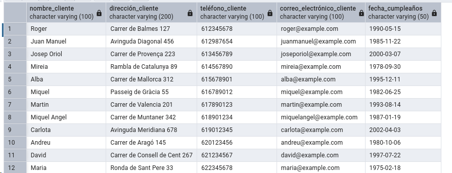
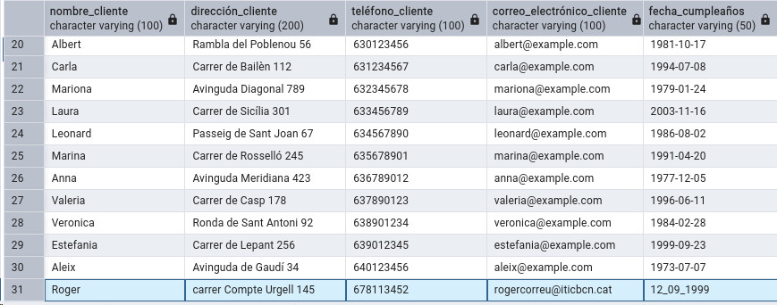
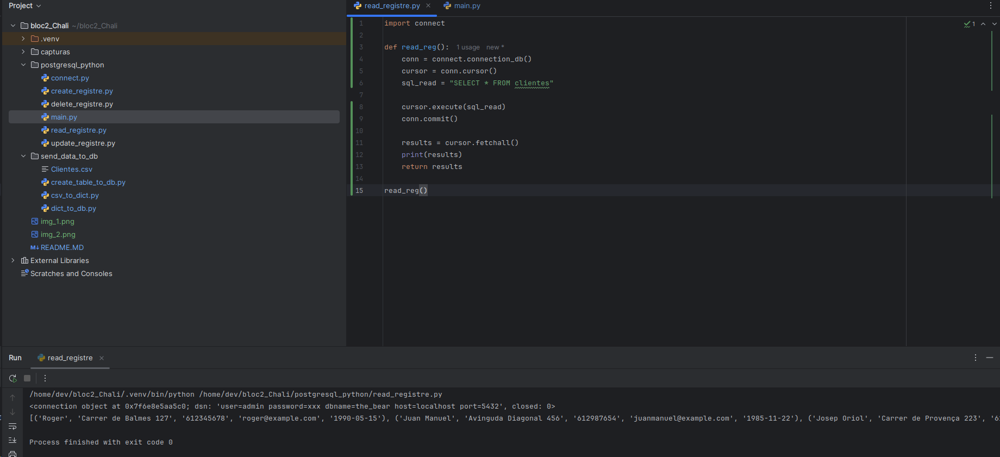
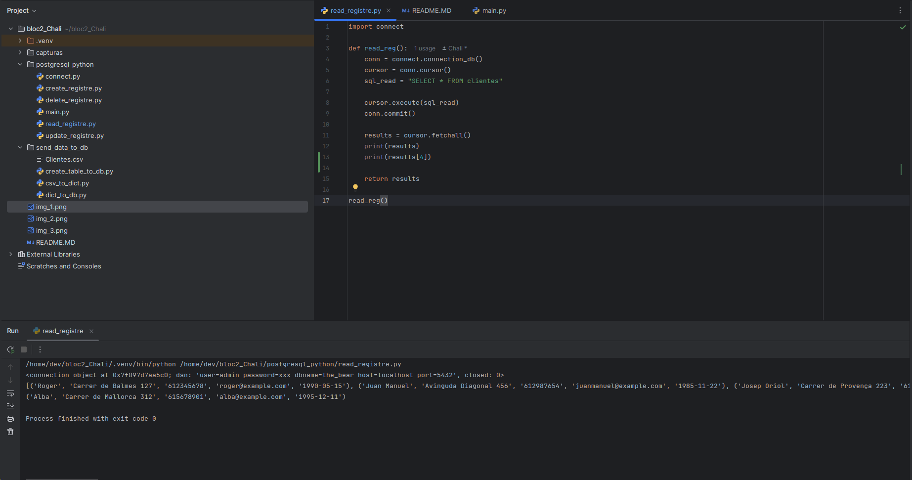

Amb això podem veure l'amfitrió i si està actiu o desactivat.
Ho hem aconseguit amb Pycharm i amb el docker activat + (sudo docker compose up -d)

Amb això veiem la nostra base de dades, amb les dades que acaben d'importar amb els programes que hem creat de python.

En aquesta imatge veiem que hem afegit la fila 31 amb les noves dades

ara s'ha imprès toda la taula en la consola

en aquesta nova línia, imprimim només la persona que demanem
