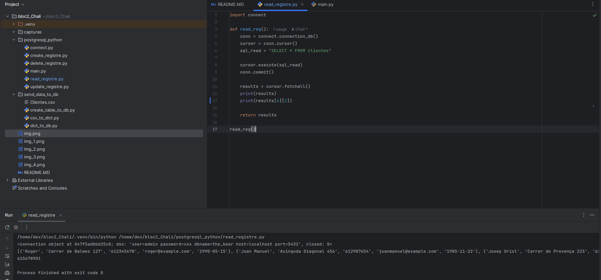
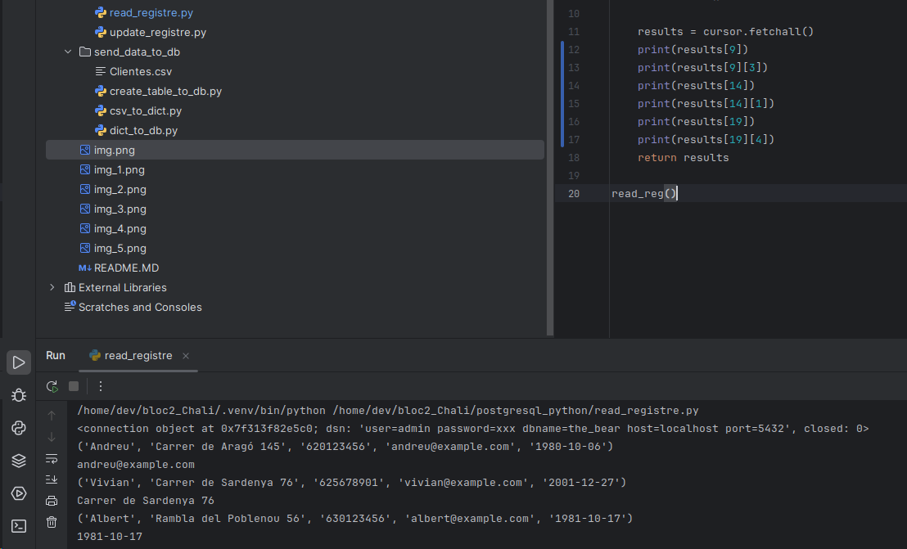
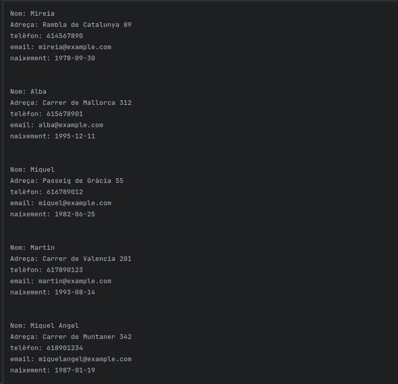
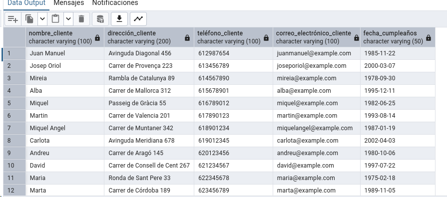
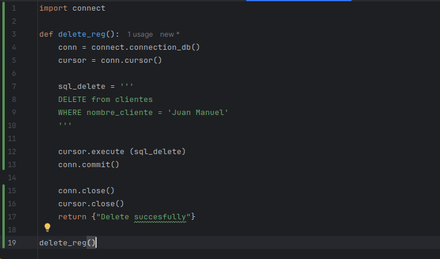
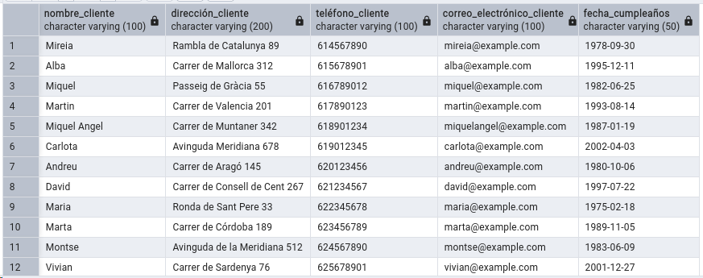

Amb això podem veure l'amfitrió i si està actiu o desactivat.
Ho hem aconseguit amb Pycharm i amb el docker activat + (sudo docker compose up -d)

Amb això veiem la nostra base de dades, amb les dades que acaben d'importar amb els programes que hem creat de python.

En aquesta imatge veiem que hem afegit la fila 31 amb les noves dades

ara s'ha imprès toda la taula en la consola

en aquesta nova línia, imprimim només la persona que demanem

en aquesta nova línia afegim un [2] en vez del [3] per només veure el seu telèfon

Mostrem les dades que ens demana de les 3 persones. Primer es mostra totes les dades i just a baix, una data específica

Mostri les dades tal com volem que aparegui i ordenat.
  
Modifiquem el número de telèfon de Roger 3 vegades que és el nº1, ja que no tenim id

Hem eliminat la persona "Roger" perquè era el número 1 i a continuació afinarem el 2 següents.
 
I així queda després d'eliminar els altres 2 primers.
